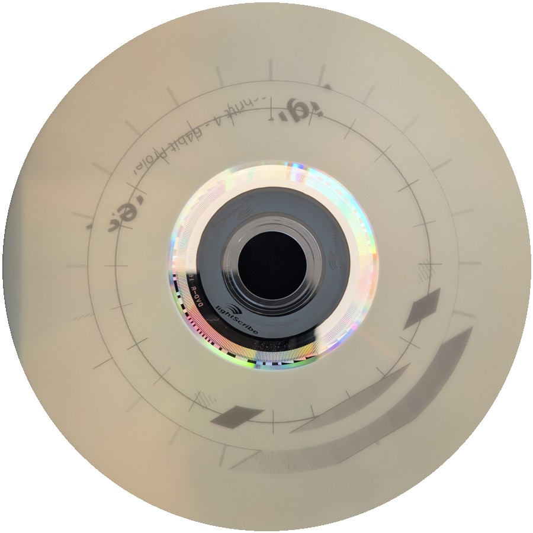
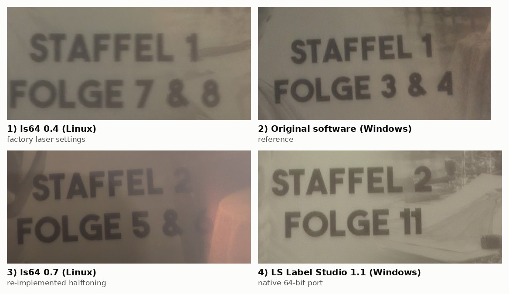

# 5 Image quality investigation

The native program burned correctly from the first attempt: right geometry, orientation and
content. But a full label next to one burned by the Windows software was **clearly paler and lower in
contrast**. This chapter follows how the cause was isolated.

 
<em>First native burn: a test ring with tick marks and a gray wedge (draft quality).</em>

## 5.1 Hypothesis 1: laser parameters – confirmed, but not sufficient

| Observation | The first full label was pale. The burn was faster than expected. |
|---|---|
| Analysis | The recorded original session writes laser parameters into mode page `0x31` before burning. The early native version only set the track pitch, so the drive ran at its factory settings (400 mm/s instead of 275 mm/s, different focus and power). |
| Fix | Add the drive/media parameter table and write the same values as the original software (focus, read/write power, velocity, mark pitch). |
| Verification | The MODE SELECT data of the native program became **byte-identical** to that of the original engine. |
| Result | Clearly better, **but still weaker than the Windows reference.** |

## 5.2 Hypothesis 2: a better Windows engine – partly wrong

The Windows engine turned out to be a newer generation than the Linux library. It contains classes
and messages for image enhancement, contrast levels and power/velocity curves that do not exist in the
Linux library. The natural assumption was that Windows preprocesses the image or computes stronger laser
settings.

Comparing the **original Linux engine** with the native program through the simulator first showed:

- **Same tone reproduction:** mark density ≈ 1 − gray/255, essentially linear, for both.
- **Different dot pattern:** the original groups marks into slightly longer runs.

| Mean run length (marks) | burned | unburned |
|---|---|---|
| Original engine | 2.0 | 1.9 |
| Native program (first version) | 1.7 | 1.5 |

## 5.3 The decisive measurement: Windows writes its burn job to a file

The official Windows COM server has a test method that redirects the complete burn job into a file
(chapter 2.4). Using it with our own small client program gave, for the first time, the **exact
Windows output** for a given image. Without Enhanced Contrast, for qualities draft/normal/best:

- **Laser parameters:** identical to the drive table and to the native program.
- **Tone curve:** identical to the original Linux engine. **There was no extra image enhancement.**
- **Track densities:** 500/760/1015 tracks/inch. The native program had used 760/1015/1398.
- **Bit pattern:** for the same image, the original Linux engine running against the simulated drive
  produced **bit-identical** data to the Windows file (all 1394 tracks).

So the Windows quality did not come from a "better engine". It came from **the original halftoning,
plus the track density**.

## 5.4 Decisive burn test

To separate "data" from "the way the drive is driven", data from the original engine was burned
**through the native drive path**:

- The original engine computed the label using the simulated drive.
- The native program took over these tracks bit-exactly and burned them with its own SCSI code.

**Result: indistinguishable from the Windows label** (owner's assessment: "perfect"). The native drive
control was therefore correct, and the remaining difference lay entirely in the halftoning. Chapter 6
describes how it was re-implemented.

## 5.5 Visual comparison

 
<em>Detail crops (same type of text element, different discs and lighting): 
1 first native version with factory laser settings · 2 original Windows software ·
3 native with re-implemented halftoning · 4 LS Label Studio 1.1 on Windows.</em>

