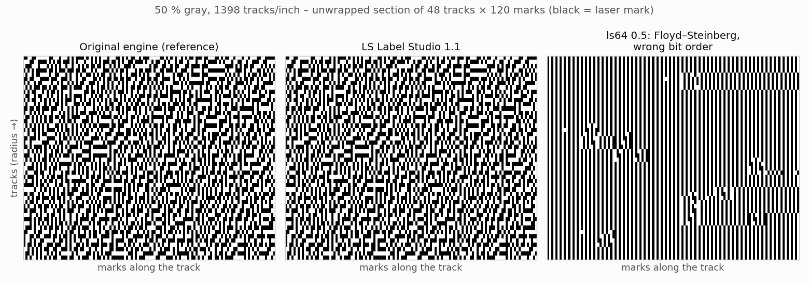
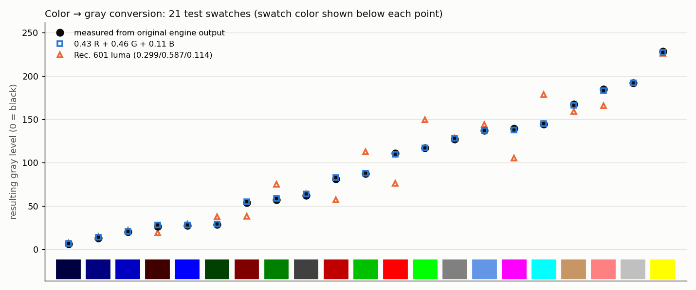

# 6 Halftoning and color conversion

## 6.1 Re-implementing the halftoning

A drive can only burn a mark or not. Gray levels are produced by the **density and arrangement** of
marks. The original engine uses an **error-diffusion** method adapted to the circular track layout:

- Each mark has a target tone. The rounding error (mark yes/no) is distributed to the next mark on the
  same track and to three neighbors on the next track.
- The **distribution weights depend on the tone itself**. A table holds four weights per gray level.
  Another table holds two thresholds per gray level. A fixed 128 × 128 binary pattern decides only in
  the region between those two thresholds. This tone-dependent weighting produces the slightly
  "clustered" pattern that burns more strongly on the disc than a classic Floyd–Steinberg pattern.
- Tracks are processed alternately in opposite directions (serpentine).
- Each track has a different number of marks, so the error buffer is **stretched** in a deterministic
  way (Bresenham-like) when moving one track outwards.

The algorithm was reconstructed from static analysis of the original library and then verified bit by
bit against reference data from the simulated drive. The tables themselves are not part of
LS Label Studio. They are read from the user's copy of the original software at setup (chapter 7).

### Bit-order error

During verification, the reference data showed that marks are stored **least significant bit first**
within each byte. The native program had been writing them most significant bit first. That mirrored
every group of eight marks, and the drive burned this without any error. The right-hand panel below
shows the effect: the carefully distributed pattern becomes a regular stripe structure.

### Agreement with the original

| Test image | Bits identical | Mark density original / ours | Mean run length burned original / ours |
|---|---|---|---|
| Flat 25 % / 50 % / 75 % gray | 93 % / 97 % / 96 % | identical | identical |
| Black | 100 % | 0.9999 / 0.9999 | identical |
| Test chart (text, lines) | 97.5 % | 0.149 / 0.149 | 29.3 / 29.4 |
| Photographic label | 67 % | 0.529 / 0.532 | 1.98 / 2.00 |

On flat fields, the first tracks are reproduced **bit-exactly**. A small deviation at the end of each
track (where the track closes on itself) is not yet explained. Error diffusion is chaotic, so this tiny
difference spreads and lowers the bit agreement on photos. **Statistically**, the output is
equivalent: density and run lengths match within a few thousandths, and the burned labels cannot be
told apart (chapter 5.5).

## 6.2 Color to gray

LightScribe burns one color only, so the original engine converts color images to gray first. Its
formula was **measured** rather than assumed:

1. A test image with 21 color swatches (pure, mixed and graded colors) was processed by the original
   engine on the simulated drive.
2. The resulting gray level of each swatch was taken from its mean mark density.

Result: **gray = 0.43 R + 0.46 G + 0.11 B**. It is linear in every channel, with no gamma and an RMS
deviation of 1.1 gray levels. This is not the common Rec. 601 luma (0.299/0.587/0.114), which deviates
by up to 35 levels on saturated colors. On sepia covers, the luma formula would have made the labels
slightly too dark.
