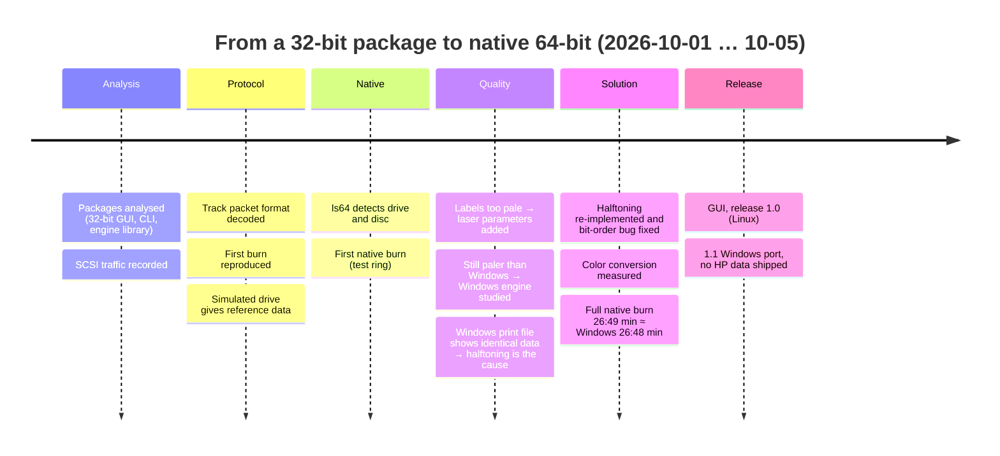
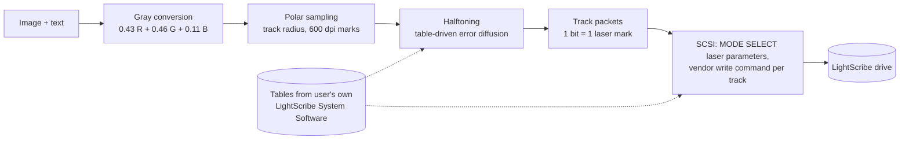

# How LS Label Studio was built – technical report

This report documents how a discontinued 32-bit LightScribe stack was replaced by a native 64-bit
implementation for Linux and Windows. It is written as a reproducible engineering log: each chapter
states the question, the method, the observation and the conclusion.

> **AI assistance.** The project was carried out by one person together with an AI model
> (Claude, Anthropic), which did the analysis, the programming and the drafting of this report. Every
> hypothesis was tested against recorded drive traffic or reference data, and every result shown here
> was verified by burning real discs.

## Abstract

LightScribe drives burn grayscale images onto the label side of special discs. On Linux, the only
software was a 32-bit library from 2008 with a 32-bit front end. The goal was a native 64-bit
replacement whose labels look as good as those of the original Windows software.

The drive protocol was reconstructed from recorded SCSI traffic. A simulated drive then let the
original engine produce reference data for any input, without discs. A first native implementation
burned correctly, but its labels were clearly paler than the Windows reference. Systematic comparison
traced this to three causes:

1. missing laser parameters
2. a different halftoning method
3. a bit-order error inside each byte

After these were fixed, the native program matched the original output statistically and
burned labels indistinguishable from the original, in the same time (26:49 vs. 26:48 min). The program
was then ported to Windows. In its final form it ships no third-party data: the required tables are read
once from the user's own copy of the original software.

## Chapters

| # | Chapter | Content |
|---|---|---|
| 1 | [Background and goal](01-background.md) | LightScribe, the starting point, requirements |
| 2 | [Methodology](02-methodology.md) | Black-box approach, simulated drive, reference data, ethics |
| 3 | [Drive protocol](03-drive-protocol.md) | Detection, track packets, burn sequence |
| 4 | [Geometry and laser parameters](04-geometry-and-parameters.md) | Tracks, marks, drive parameter tables |
| 5 | [Image quality investigation](05-image-quality.md) | Why the first labels were pale, and the decisive test |
| 6 | [Halftoning and color](06-halftoning-and-color.md) | Re-implementation and verification |
| 7 | [Cross-platform and distribution](07-cross-platform.md) | Windows port, table extraction, GUI |
| 8 | [Results and limitations](08-results-and-limitations.md) | Measurements, open points |

## Timeline

## Pipeline (final)

